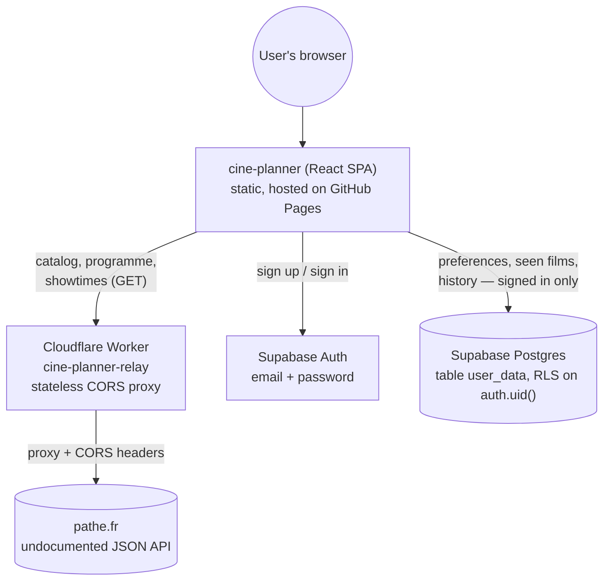

# CinéPlanner

Pathé showtime planner: pick your nearby cinemas, the films you want to see, your pacing and
travel preferences — the app generates several day plans that maximize the number of films seen,
timing and travel included.

100% front-end: no custom backend, no server-side business logic. Planning itself works with no
account (one-shot: pick cinemas/films/preferences, get a plan for that session). Saving anything
— preferences for next time, seen films, planning history — requires a free account (Supabase Auth
+ Postgres, see below); without one, nothing persists across sessions.

## Features

- Geolocation → list of nearby Pathé cinemas (manual search also possible)
- Multi-cinema and multi-film selection, with real posters and info
- Reusable preferences: session pacing (relaxed / standard / tight), tolerance to travel,
  transport mode
- Planning algorithm (exact search via bitmask) that generates several possible combinations,
  ranked by number of films then by comfort
- Account (email + password, via Supabase Auth): reusable preferences, tracking of already-seen
  films, history of closed plannings — all optional, the planner works without an account too

## Architecture

No custom backend: the SPA talks directly to two free third-party services, each doing exactly
one job.



- The planning algorithm itself runs entirely client-side (see below) — no request round-trip
  needed to generate a plan.
- The Worker (`worker/`) is intentionally dumb: no auth, no storage, it only forwards allow-listed
  GET requests to pathe.fr and adds CORS headers pathe.fr doesn't send itself.
- Supabase is reached directly from the browser via `supabase-js` (Data API / PostgREST) — access
  control is enforced by the RLS policy on `user_data`, not by a server in the middle.

## Getting started

```bash
npm install
npm run dev
```

The API relay (see below) **must be configured** in `.env` for the app to work: without it, no
data is fabricated — the app shows explicit API errors instead.

## Data sources — and their limits

Pathé has no official public API. This app relies on the undocumented JSON endpoints used by
pathe.fr itself:

| Endpoint | Content | Used for |
| --- | --- | --- |
| `/api/cinemas` | List of the 68 Pathé cinemas (name, address, GPS) | Proximity selection (frozen in `src/data/cinemas.json`, a snapshot is enough — the cinema list rarely changes) |
| `/api/shows` | Film catalog (title, poster, synopsis, duration, genres…) | Film sheets, live via the relay |
| `/api/cinema/{slug}/shows` | For each film, the days it's actually scheduled at that cinema | Real per-cinema/day availability, live via the relay |
| `/api/show/{filmSlug}/showtimes/{cinemaSlug}/{date}` | Exact sessions (start time `time`, end time `endTime`, version) | Real showtimes displayed in plannings, live via the relay |

Everything — catalog, per-cinema programme, exact showtimes — comes live from Pathé via the relay.
If a request fails (relay not configured, unreachable, or Pathé doesn't cover a given
film/cinema/date combination), the app shows an explicit error message instead of fabricating
fallback data.

### CORS

These endpoints don't send an `Access-Control-Allow-Origin` header: a browser can't call them
directly from another domain. To stay "just a front-end" with no database or server-side business
logic, this repo includes a **minimal CORS relay** (`worker/`, free Cloudflare Worker) that only
forwards requests to pathe.fr while adding CORS headers.

Deploy the relay:

```bash
cd worker
npm install
npx wrangler login   # free Cloudflare account
npm run deploy
```

Then set the URL it prints in `.env` (`VITE_API_PROXY_URL=...`).

## Account and saving data

The planning wizard works with no account (one-shot: the generated plan is only visible for the
current session). Signing in lets you save:

- preferences (cinemas, pacing, transport mode) for next time,
- already-seen films,
- the history of closed plannings and the plannings currently in progress.

A free [Supabase project](https://supabase.com) (Auth email/password + a Postgres table) handles
this — no custom backend. Setup:

1. Create a free Supabase project.
2. Enable the "Email" Auth provider.
3. Create the generic key/value storage table (one account, one `key`/`value` JSON pair per saved
   piece of data):

   ```sql
   create table user_data (
     user_id uuid references auth.users not null,
     key text not null,
     value jsonb not null,
     updated_at timestamptz not null default now(),
     primary key (user_id, key)
   );
   alter table user_data enable row level security;
   create policy "own rows" on user_data for all using (auth.uid() = user_id) with check (auth.uid() = user_id);
   grant select, insert, update, delete on table user_data to authenticated;
   ```

   The last `grant` is required if "Automatically expose new tables" is disabled in Project
   Settings → API (recommended by Supabase) — RLS alone filters *rows*, it doesn't substitute for
   the table-level privilege Postgres checks first. Only `authenticated` needs it: signed-out
   users never call this table (see `useCloudState.ts`), so there's no reason to grant `anon`
   anything here.

4. Set `VITE_SUPABASE_URL` and `VITE_SUPABASE_ANON_KEY` (Project Settings → API) in `.env`.
5. Authentication → URL Configuration → add every URL the app is served from (e.g.
   `http://localhost:5173` for dev, `https://cca282.github.io/cine-planner/` for prod) to
   **Redirect URLs**. Required for "forgot password" emails: Supabase only honors the `redirectTo`
   passed to `resetPasswordForEmail` if it matches one of these — otherwise the link in the email
   silently falls back to the project's default Site URL instead of bringing the user back to the
   app.

Without `VITE_SUPABASE_URL`/`VITE_SUPABASE_ANON_KEY`, the app still starts (with a console warning)
but stays in one-shot mode only: no sign-in, nothing gets saved.

Password reset: "Mot de passe oublié ?" on the sign-in form sends a reset email
(`resetPasswordForEmail`); the emailed link brings the user back to the app in a recovery session,
which triggers a "choose a new password" prompt (`PasswordRecoveryModal`) on top of whichever page
they land on.

## Planning algorithm

For a given date and pacing:

- **Relaxed**: you arrive at the announced time (trailers included), ≥20 min of buffer is required after a session at the same cinema before the next one.
- **Standard**: same but ≥10 min of buffer.
- **Tight**: you arrive 15 min after the announced time (end of trailers), which allows back-to-back sessions where one ends exactly when the next starts, at the same cinema.

Travel between cinemas is estimated as the crow flies (× 1.3 to approximate road distance) with an
effective speed per transport mode (bike/transit/car) — no routing API is used, so it's an
approximation, presented as such in the UI.

The algorithm does an exact bitmask search over the selected films (≤ 14) to find the best
combination of compatible sessions, then returns the best distinct options (descending film count,
then comfort).

## Stack

Vite + React + TypeScript + Tailwind CSS v4 + React Router (`HashRouter`, for a static deployment
with no server configuration). Supabase (`@supabase/supabase-js`) for auth + storage — the only
non-trivial runtime dependency.

## Installing as an app

`vite-plugin-pwa` generates a web manifest + service worker at build time, so the site is
installable ("Add to Home Screen" on iOS Safari, the install prompt on Android Chrome) and opens
without browser chrome (`display: standalone`). The service worker only precaches the static app
shell (JS/CSS/HTML/icons) for faster reloads — it doesn't cache Pathé data or Supabase responses,
so the app still needs a network connection to actually plan anything.

Icons live in `public/pwa-icons/`, generated from `public/favicon.svg` via `rsvg-convert` +
`magick` (ImageMagick's own SVG rasterizer mangles this file's masks/gradients — `librsvg` renders
it correctly). Regenerate them if `favicon.svg` changes:

```bash
rsvg-convert -w 130 -h 130 public/favicon.svg -o /tmp/logo-130.png
rsvg-convert -w 346 -h 346 public/favicon.svg -o /tmp/logo-346.png
rsvg-convert -w 300 -h 300 public/favicon.svg -o /tmp/logo-300.png
rsvg-convert -w 120 -h 120 public/favicon.svg -o /tmp/logo-120.png
magick /tmp/logo-130.png -background none -gravity center -extent 192x192 public/pwa-icons/icon-192.png
magick /tmp/logo-346.png -background none -gravity center -extent 512x512 public/pwa-icons/icon-512.png
magick /tmp/logo-300.png -background "#0a0a0a" -gravity center -extent 512x512 public/pwa-icons/maskable-512.png
magick /tmp/logo-120.png -background "#0a0a0a" -gravity center -extent 180x180 public/pwa-icons/apple-touch-icon.png
```

## Deployment

Any static file host (Cloudflare Pages, Netlify, Vercel, GitHub Pages with a public repo…):

```bash
npm run build   # -> dist/
```

This repo deploys to GitHub Pages via `.github/workflows/deploy.yml`, which reads
`VITE_API_PROXY_URL`, `VITE_SUPABASE_URL` and `VITE_SUPABASE_ANON_KEY` from the repo's Actions
variables (Settings → Secrets and variables → Actions → Variables). The Supabase anon key is
meant to be public (it's the same key `supabase-js` ships to every browser) — access control is
enforced server-side by the RLS policy on `user_data`, not by keeping this key secret.
